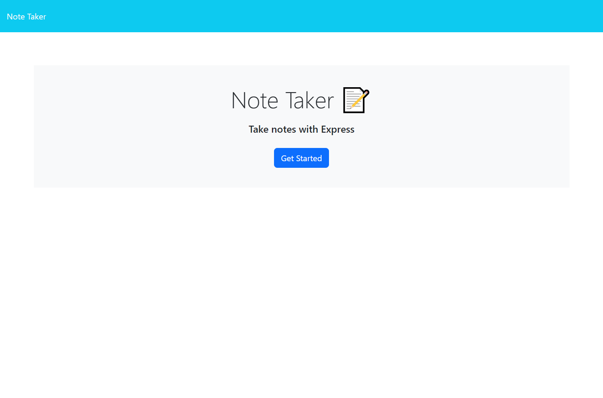
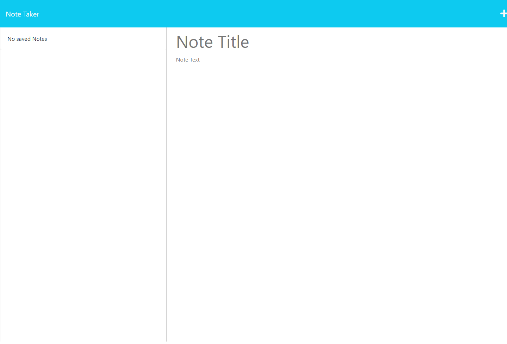
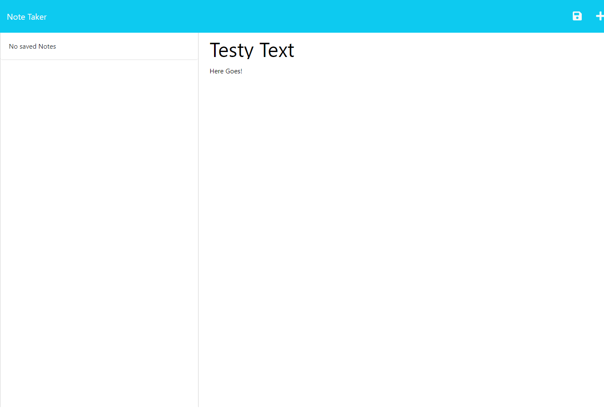
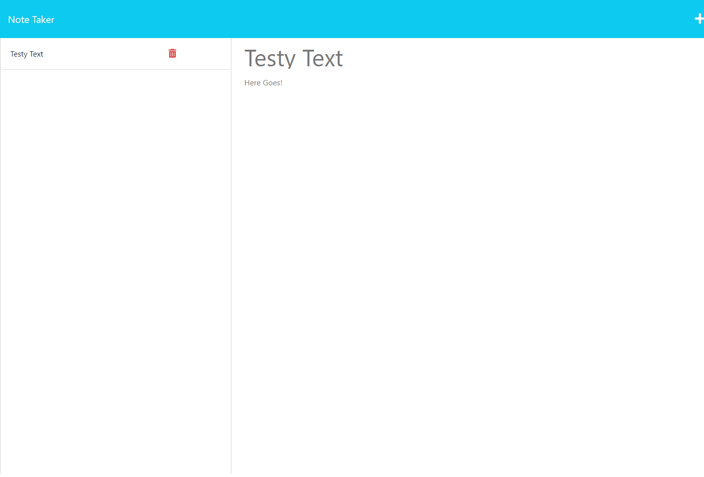

# Note-Taker
Challenge 11

  

  ## Description
  Note-Taker is a browser application for making organized and consolidated notes. Notes can be created, viewed, and deleted from the application interface, and will persist between uses of the application.
  
  ## Table of Contents
  - [Installation](#installation)
  - [Usage](#usage)
  - [Contributing](#contributing)
  - [Tests](#tests)
  - [License](#license)
  - [Questions](#questions)
  
  ## Installation
  This app is deployed on Heroku: https://gentle-temple-51868-693f69119013.herokuapp.com/
  
  ## Usage
  Opening the app will take you to the landing page. Clicking the "Get Started" button will route you to the main application, which will feature two columns. The one on the left will list any saved notes, and the right will have open fields for entering a note title and text. Entering text into these fields will cause a floppy-disk icon to appear at the top right of the screen; clicking on it will save the entered text as a new note. Clicking on a note from the left column will display it to the right in a "read-only" format. Clicking the "plus" icon at the top right of the screen will clear any text in the right column, allowing you to enter text for a new note. Clicking on any of the red trashcan icons in the left column will delete the note in that row.

  ## Screenshots
  
  
  
  

  ## Contributing
  Contributors: Greg Skudlarek
  
  ## License
  

  This application is covered under the MIT License. Click the badge to learn more.
  
  ## Questions
  Questions can be sent via the listed methods.
  
 
  GitHub: [dopalescent](https://github.com/dopalescent)
  

  Email: skudlgre000@gmail.com